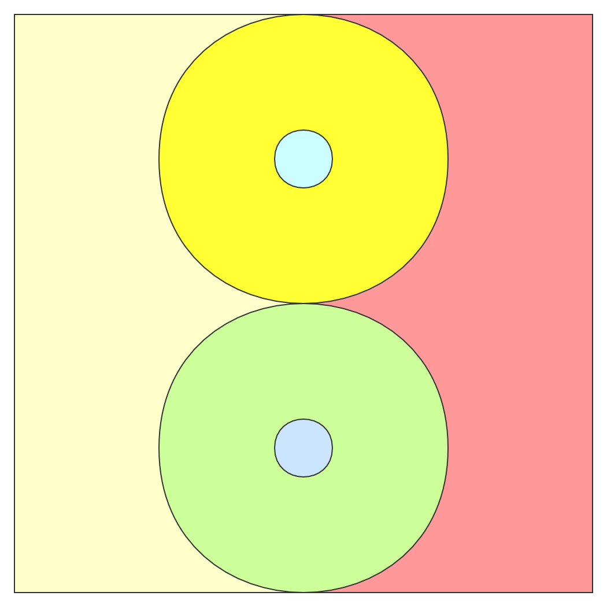

# taichi
> How to build a taichi totem with pure css?
## Overview
This is the final result 


Now it's time to implement it!

## Steps
First of all, we need to divide the taichi totem into many components as followed.



In order to show clearly, I painted each part in a different color.

So we have following html tags:

```html
<!-- light yellow part -->
<div class="taichi--left"></div>
<!-- red part -->
<div class="taichi--right"></div>
<!-- dark yellow part -->
<div class="taichi--up"></div>
<!-- green part -->
<div class="taichi--down"></div>
<!-- light blue part -->
<div class="taichi--inner-up"></div>
<!-- dark blue part -->
<div class="taichi--inner-down"></div>
```
With a little simple style, the totem has a basic prototype.
```css
.taichi-wrapper {
    height: 100vh;
    display: flex;
    justify-content: center;
    align-items: center;
    flex-direction: column;
}

.taichi {
    width: 400px;
    height: 400px;
    position: relative;
    overflow: hidden;
    border-radius: 200px;
}

.taichi--left {
    width: 50%;
    height: 100%;
    position: absolute;
    left: 0;
    background-color: black;
}

.taichi--right {
    width: 50%;
    height: 100%;
    position: absolute;
    right: 0;
    background-color: white;
}

.taichi--up {
    width: 50%;
    height: 50%;
    position: absolute;
    left: 50%;
    margin-left: -25%;
    border-radius: 200px;
    background-color: black;
}

.taichi--down {
    width: 50%;
    height: 50%;
    position: absolute;
    left: 50%;
    top: 50%;
    margin-left: -25%;
    border-radius: 200px;
    background-color: white;
}

.taichi--inner-up {
    width: 50px;
    height: 50px;
    position: absolute;
    top: 5%;
    left: 50%;
    margin-left: -25px;
    margin-top: 50px;
    border-radius: 50px;
    background-color: white;
}

.taichi--inner-down {
    width: 50px;
    height: 50px;
    position: absolute;
    bottom: 5%;
    left: 50%;
    margin-left: -25px;
    margin-bottom: 50px;
    border-radius: 50px;
    background-color: black;
}
```
Let's check it out.


Next, we solve the most important and difficult part and let the image rotate.

We can use the `rotate` attribute in css to make the totem rotate.

Using @keyframes rules, we can create animations which gradually change from one CSS style setting to another.

The animation part looks like:
```css
@keyframes taichi {
    from {
        transform: rotate(0deg);
    }
    to {
        transform: rotate(360deg);
    }
}
```
We apply the animation to taichi class, so the totem will start rotate slowly.

```css
.taichi {
    animation: taichi 10s linear infinite;
}
```
